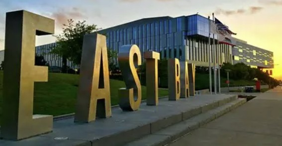

Academic Achievements:

{width="75%" height="75%" fig-align="center"}
California State University East Bay: Bachelor's of Science in Industrial Engineering, Minor in Mathematics (2017)
Cum Laude Graduate

{width="75%" height="75%" fig-align="center"}
Currently Pursuing Master's in Applied Business analytics (Expected 2026)

