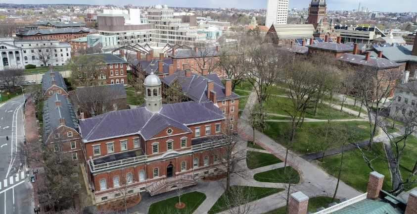

## Academic Achievements

::: {.column width="45%"}
{height="150px"}

**California State University, East Bay**

Bachelor of Science in Industrial Engineering  
*Minor in Mathematics — Graduated 2017*
:::

::: {.column width="45%"}
{height="150px"}

**Boston University Metropolitan College**

Master of Science in Applied Business Analytics  
*In Progress — Expected 2026*
:::